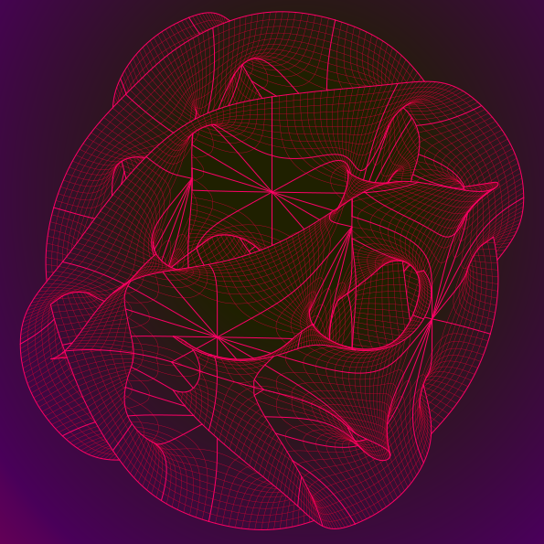

In the case of string theory, consistency requires Spacetime to have 10 dimensions (3D regular space + 1 time + 6D hyperspace).<a href="#fn1">[1]</a> The **Calabi Yau manifold** is a complex Fermat Surface with applications in theoretical physics, particularly in superstring theory, the extra dimensions of spacetime are sometimes conjectured to take the form of a 6-dimensional Calabi–Yau manifold.<a href="#fn2">[2]</a>

On the algorithm, [Andrew J. Hanson](https://www.cs.indiana.edu/~hansona/papers/CP2-94.pdf) explains the resultant visualisation "contains enough information to check that it’s a consistent local depiction of the complete manifold and so is still a sufficient (although not ideal) representation."

---

## Tools

* [Rhino](http://www.rhino3d.com/download/rhino-for-mac/5/wip)
* [Wolfram Programming Lab](https://lab.open.wolframcloud.com/app/view/newNotebook?ext=nb)

### Rhino Plugins

MacOS install paths for:

* Grasshopper: `~/Library/Application Support/McNeel/Rhinoceros/MacPlugIns/Grasshopper/Libraries`
* Other: `~/Applications/RhinoWIP.app/Contents/Resources/ManagedPlugIns`

### Documentation

* [Rhino Primer](http://developer.rhino3d.com/guides/rhinopython/primer-101/)
* [mcneel/rhinocommon](https://github.com/mcneel/rhinocommon)

---

## Development

* Install [Atom](https://atom.io/) text editor
* Enable `Python` syntax
* Install the following syntax packages
  - [`linter-mathematica`](https://atom.io/packages/linter-mathematica)
  - [`rhino-python`](https://atom.io/packages/rhino-python)

---

## Process

* `RunPythonScript` [`__init__.py`](/lib/__init__.py)

### 1. Generate Intersection Curves

* `RunPythonScript` [`IntersectSurfaces()`](/lib/macro/intersect_surfaces.py) to generate intersection curves

### 2. Generate 2D View

* `RunPythonScript` [`Make2d()`](/lib/macro/make2d.py) to generate raw 2D curves.
* Visible `PolySurfaces::1`
* Visible `Intersect::Curves`
* Rotate model or select the preferred view
* Select objects on `PolySurfaces::1` and `Intersect::Curves`
* Set DocumentProperties > Model > Absolute tolerance to [`0.1`](/1.png)
* Run [`Make2D`](/2.png)
* Rename `Make2D` layer
* Set DocumentProperties > Model > Absolute tolerance to `0.001`
* Run `Make2D`
* Visible `Curves::1::0::U`
* Select objects on `Curves::1::0::U`
* Set DocumentProperties > Model > Absolute tolerance to `0.0000000001`
* Run `Make2d`
* Invisible `Curves::1::0::U`
* Visible `Curves::1::0::V`
* Select objects on `Curves::1::0::V`
* Run `Make2d`
* Perform manual selection/correction using:
  - `Trim` by one or more cutting objects
  - `Split` by one or more cutting objects
  - `ContinueCurve` adding additional Control Points
  - `BlendCrv` to fill between two visually continuous Curves
  - `Join` continuous Curves within tolerance of each other

### Export/Import Views

* Open source file
* `RunPythonScript` [`ExportNamedViews()`](/lib/macro/export_named_views.py) to write view coordinates to `./views.json`
* Create a new file
* `RunPythonScript` [`CalabiYau.Run()`](/lib/__init__.py)
* `RunPythonScript` [`ImportNamedViews()`](/lib/macro/import_named_views.py)

### Export Vector/Raster

* `SelectAll` 2D Curves
* `File > Export Selected` as Adobe Illustrator `.ai`
* `File > Export Selected` as Rhino `.3dm`
* `Open` exported curves with **Adobe Illustrator** (**NOTE exported SVG data is incompatible with anything other vector editor**)
  - `Select All`
  - `Resize` selection so that the largest dimension measures `200mm`
  - `Drag` selection into centre of `Artboard` measuring `210x210mm`
  - Set `Stroke Width` to `0.4mm`
  - `Save As` `.eps`

Copy [`A4[SQRDIV].ait`](/A4[SQRDIV].ait) to `/Applications/Adobe\ Illustrator\ CC\ 2017/Cool\ Extras.localized/en_GB/Templates/A4[SQRDIV].ait`

Rasterize `File > Export > Export As` [`.psd`](/3.png)

* Select whitespace on `5-d-4::visible::lines::PolySurfaces::1`
* Create a New Layer at bottom of Layer stack
* Fill selection with paper colour sample

---

## Sources

1. <a id="fn1" href="https://en.wikipedia.org/wiki/Superstring_theory#Extra_dimensions">Supertring Theory</a>
2. <a id="fn2" href="https://en.wikipedia.org/wiki/Calabi%E2%80%93Yau_manifold">Calabi-Yau manifold</a>
3. [Wolfram Mathematica](/examples/mathematica/plot_1.nb)  [[Source](http://demonstrations.wolfram.com/CalabiYauSpace/)]
4. [Wolfram Mathematica](/examples/mathematica/plot_2.nb)  [[Source](http://kaurov.com/wordpress/?p=1246)]
5. [Wolfram Mathematica](/examples/mathematica/plot_3.nb)
6. [Wolfram Mathematica](/examples/mathematica/plot_4.nb)
7. [Wolfram Mathematica](/examples/mathematica/plot_5.nb)
8. [Wolfram Mathematica](/examples/mathematica/plot_6.nb)
9. [Calabi-Yau and Hanson's surfaces](/research/9.html)
10. [SketchUp](https://3dwarehouse.sketchup.com/model/73d1a448bc4c446d8389babcf188871/Manifolds)
11. [Rhino](http://www.tanjiasi.com/surface-design/)
12. ["Visualizing the Path from Fermat's Last Theorem to Calabi-Yau Spaces", Hanson, Andrew J.](https://www.youtube.com/watch?v=Yz6gltKeoM8)
13. ["Calabi-Yau manifold"](http://scholarpedia.org/article/Calabi-Yau_manifold)
14. ["Calabi - Yau Manifolds"](https://mathoverflow.net/questions/42707/calabi-yau-manifolds)
15. ["Dimensions of Time"](http://dimensions-of-time.blogspot.com.au/)
16. ["Mesh Generation with Python"](http://prideout.net/blog/?p=44)
17. ["The Elegant Universe", Greene, Brian]()
18. ["The Fabric of the Cosmos", Greene, Brian]()
19. ["A Construction for Computer Visualization of Certain Complex Curves", Hanson, Andrew J.](https://www.semanticscholar.org/paper/A-Construction-for-Computer-Visualization-of-Certa-Hanson/8861c0026a89af89b19e9df7267846ec056461c1?citingPapersSort=is-influential&citingPapersLimit=10&citingPapersOffset=10&citedPapersSort=is-influential&citedPapersLimit=10&citedPapersOffset=0)

---

## TODO

* Implement concurrency
